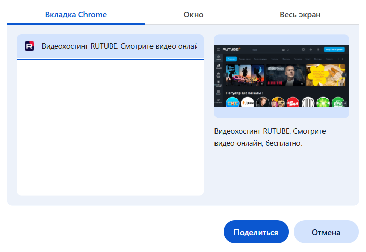
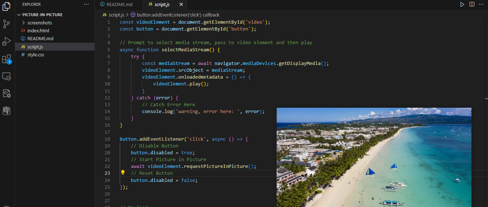

# picture-in-picture (картинка в картинке)
Описание: Приложение позволяет вывести видео в небольшое плавающее окно, которое остается поверх всех остальных окон, что позволяет пользователю продолжать просматривать его, занимаясь при этом другими делами. 
При запуске приложения по запросу пользователь выбирает нужное окно для просмотра, благодаря Screen Capture API происходит захват экрана. После этого, при нажатии пользователем кнопки "СТАРТ", с помощью Picture-in-Picture Web API, экран с видео располагается поверх всех остальных окон, при этом можно изменять его размеры, местоложение и т.п. 
**Шаг 1:**

**Шаг 2:**

**Шаг 3:**

